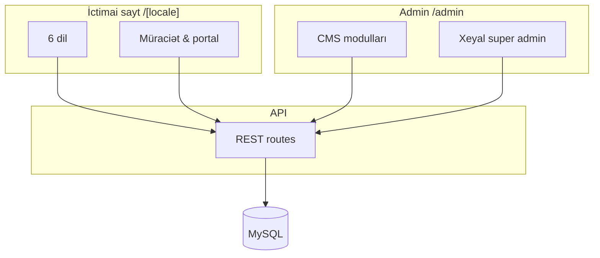

<div align="center">

# OstWind Group

**Beynəlxalq təhsil məsləhətçiliyi — 6 dilli vitrin, CMS və super admin mərkəzi**

[](https://nextjs.org/)
[](https://react.dev/)
[](https://www.typescriptlang.org/)
[](https://www.prisma.io/)
[](https://tailwindcss.com/)

**[Canlı sayt](https://frontend.ostwind.az/)** · **[Demo /az](https://frontend.ostwind.az/az)** · **[Admin](/admin/login)**

<br />


</div>

---

## Haqqında

**OstWind Group**, xaricdə təhsil almaq istəyən tələbələr üçün hazırlanmış müasir veb platformadır. İctimai saytda universitetlər, xidmətlər və müraciət formları; admin panelində isə tam idarəetmə, çoxdilli məzmun və təhlükəsizlik alətləri təqdim olunur.

| | |
|---|---|
| **Bazar** | Azərbaycan, Türkiyə, Ukrayna, Gürcistan və region |
| **Fokus** | Universitet qəbulu, viza, sənədlər, yaşayış, dil kursları |
| **Dillər** | AZ · TR · EN · RU · UK · GE |

---

## Əsas imkanlar

### İctimai sayt

- 6 dil (`next-intl`, locale routing)
- Ana səhifə: hero slaydlar, statistika, üstünlüklər, CTA — **CMS-dən idarə**
- Universitetlər, xidmətlər, qiymətlər, blog, FAQ, haqqımızda, əlaqə
- **Tələbə hesabı**: qeydiyyat, giriş, onlayn qəbul formu, PDF xülasə
- SEO meta, responsive, dark mode

### Admin paneli

- Modul əsaslı icazələr (10 CMS modulu)
- Rollar: `SUPER_ADMIN` · `ADMIN`
- Admin interfeysi **6 dildə** (AZ/TR/EN/RU/UK/GE)
- TOTP 2FA, audit log, sessiya idarəetməsi
- Soft delete + zibil qutusu
- SMTP e-poçt (Xeyal paneli)
- DeepL ilə avtomatik tərcümə (opsional)

### Xeyal (super admin)

- Ana səhifə məzmunu: hero mətnləri, slayd şəkilləri, statistika, üstünlüklər
- Header / footer menyu mətnləri (6 dil)
- Onlayn qəbul müraciətləri, media, SEO, e-poçt, bildirişlər

---

## Texnologiya

| Qat | Stack |
|-----|--------|
| **Frontend** | Next.js 16 App Router · React 19 · Tailwind CSS v4 · TypeScript |
| **Backend** | API Routes · NextAuth 4 (JWT) · bcrypt · otplib |
| **DB** | MySQL 8 · Prisma ORM |
| **i18n** | `messages/*.json` · admin `messages/admin/*` · CMS `Json` sahələri |
| **PDF** | pdf-lib · özəl fontlar (`public/fonts`) |

---

## Arxitektura



---

## Layihə strukturu

```
ostwind/
├── messages/              # İctimai tərcümələr (az, tr, en, ru, uk, ge)
├── messages/admin/        # Admin panel tərcümələri
├── prisma/schema.prisma   # Veritabanı sxemi
├── scripts/               # Seed, deploy, bakım
├── public/
│   ├── images/            # Loqo, hero slaydlar
│   └── fonts/             # PDF üçün fontlar
└── src/
    ├── app/[locale]/      # İctimai səhifələr + auth + portal
    ├── app/admin/         # CMS + Xeyal
    ├── app/api/           # Admin, tələbə, public API
    ├── components/        # UI + admin komponentləri
    └── lib/               # site-content, auth, PDF, i18n
```

---

## Quraşdırma

### Tələblər

- Node.js **20.x** və ya **22.x** (LTS)
- MySQL **8.x**
- npm

### Addımlar

```bash
git clone https://github.com/xeyal9032/ostwind.git
cd ostwind

npm install

cp .env.example .env
# DATABASE_URL, NEXTAUTH_SECRET, NEXTAUTH_URL doldurun

npx prisma db push
npx prisma generate

node scripts/create-admin.mjs

# Ana səhifə məzmununu 6 dilə doldur (opsional, DB boşdursa)
npm run seed:site-content

npm run dev
```

| Səhifə | URL |
|--------|-----|
| Ana səhifə (AZ) | `http://localhost:3000` və ya `/az` |
| Türkçe | `/tr` |
| Admin giriş | `/admin/login` |
| Xeyal | `/admin/xeyal` *(SUPER_ADMIN)* |
| Tələbə portalı | `/[locale]/portal/admission` |

---

## Mühit dəyişənləri

| Dəyişən | Məcburi | Təsvir |
|---------|---------|--------|
| `DATABASE_URL` | Bəli | MySQL connection string |
| `NEXTAUTH_SECRET` | Bəli | Production: min. 32 simvol |
| `NEXTAUTH_URL` | Bəli | Məs: `http://localhost:3000` |
| `DEEPL_API_KEY` | Xeyr | Admin DeepL tərcüməsi |

```powershell
# NEXTAUTH_SECRET (PowerShell)
[Convert]::ToBase64String((1..32 | ForEach-Object { Get-Random -Maximum 256 }))
```

---

## NPM skriptləri

| Əmr | Təsvir |
|-----|--------|
| `npm run dev` | İnkişaf serveri |
| `npm run build` | Production build |
| `npm run start` | Production server |
| `npm run lint` | ESLint |
| `npm run deploy:check` | Deploy öncəsi yoxlama |
| `npm run seed:site-content` | Ana səhifə CMS — 6 dil seed |
| `npm run seed:site-content:dry` | Seed önizləmə (DB yazmır) |

### Faydalı skriptlər

```bash
node scripts/db-stats.mjs
node scripts/pre-deploy-check.mjs
node scripts/reset-admin-password.mjs EMAIL yeniSifre
node scripts/ensure-admin-users.mjs
```

---

## Dillər

| Kod | Dil | Default |
|-----|-----|---------|
| `az` | Azərbaycan | ✓ |
| `tr` | Türkçe | |
| `en` | English | |
| `ru` | Русский | |
| `uk` | Українська | |
| `ge` | ქართული | |

---

## Təhlükəsizlik

- JWT sessiya (30 gün)
- Admin üçün TOTP 2FA
- Modul icazələri (`permissions` JSON)
- Soft delete — daimi silmə yalnız Xeyal zibil qutusundan
- Admin əməliyyatları **audit log**-da
- `public/uploads/` — şəxsi sənədlər; repoya daxil edilmir

---

## Git & GitHub (versiya tarixçəsi)

Bütün commit-lər GitHub-da qalır. Avtomatik push və etiketlər:

**[docs/GIT-VERSIONLAMA.md](./docs/GIT-VERSIONLAMA.md)**

```bash
npm run git:hooks:install    # bir dəfə
npm run git:auto-push:on     # hər commit-dən sonra push
npm run git:sync -- "mesaj"  # add + commit + push
```

---

## Deploy

cPanel Node.js App üçün hazırlanıb. Ətraflı:

**[CANLIYA-HAZIRLIK.md](./CANLIYA-HAZIRLIK.md)**

```bash
npm run build
npm run deploy:check
```

---

## İnkişaf etdirici

<div align="center">

<a href="https://github.com/xeyal9032">
  <br />
  <strong>Khayal Jamilli</strong>
</a>

<br />

Web Designer & Developer · OstWind Group  
<a href="https://frontend.ostwind.az/">frontend.ostwind.az</a>

<br /><br />

[](https://github.com/xeyal9032)
[](https://www.linkedin.com/in/khayaljamilli9032)
[](https://instagram.com/xeyal9032)

<br />

**© 2026 OstWind Group**

</div>
