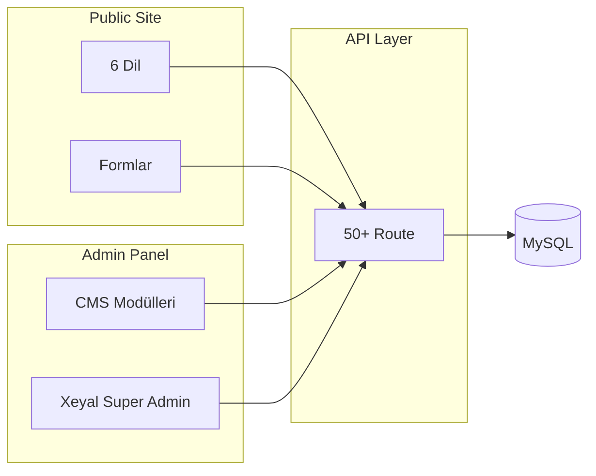

<div align="center">

# 🎓 OstWind Group

**Uluslararası eğitim danışmanlığı platformu — çok dilli vitrin, CMS ve süper admin merkezi**

[](https://nextjs.org/)
[](https://react.dev/)
[](https://www.typescriptlang.org/)
[](https://www.prisma.io/)
[](https://tailwindcss.com/)

[Canlı Site](https://frontend.ostwind.az/) · [Demo — Ana Sayfa](/az) · [Admin Panel](/admin/login)

<br />


</div>

---

## 📖 Hakkında

**OstWind Group**, yurtdışı eğitim danışmanlığı sunan modern bir web platformudur. Öğrenciler partner üniversitelere başvurabilir; ekip ise güçlü bir admin paneli üzerinden tüm içeriği yönetir.

| | |
|---|---|
| 🌍 **Hedef pazar** | Azerbaycan, Türkiye, Ukrayna, Gürcistan ve çevre bölgeler |
| 🏛️ **Odak** | Üniversite başvuruları, vize, evrak, konaklama, dil kursları |
| 🗣️ **Diller** | Azərbaycan, Türkçe, English, Русский, Українська, ქართული |

---

## ✨ Özellikler

<table>
<tr>
<td width="50%" valign="top">

### 🌐 Public Site
- 6 dilli arayüz (`next-intl`)
- Üniversite, hizmet, fiyat, blog, SSS sayfaları
- Başvuru ve iletişim formları
- SEO meta alanları (title, description, OG)
- Responsive, dark mode destekli tasarım
- Hero slider ve animasyonlu istatistikler

</td>
<td width="50%" valign="top">

### 🔐 Admin & Xeyal
- Rol tabanlı CMS (10 modül izni)
- **SUPER_ADMIN** / **ADMIN** rolleri
- TOTP 2FA (Google Authenticator)
- Audit log, oturum yönetimi, online durum
- Soft delete + çöp kutusu
- SMTP e-posta bildirimleri
- DeepL ile otomatik çeviri (opsiyonel)

</td>
</tr>
</table>

---

## 🛠️ Teknoloji Yığını

<table>
<tr>
<th>Katman</th>
<th>Teknolojiler</th>
</tr>
<tr>
<td><strong>Frontend</strong></td>
<td>Next.js 16 App Router · React 19 · Tailwind CSS v4 · TypeScript</td>
</tr>
<tr>
<td><strong>Backend</strong></td>
<td>Next.js API Routes · NextAuth 4 (JWT) · bcrypt · otplib</td>
</tr>
<tr>
<td><strong>Veritabanı</strong></td>
<td>MySQL · Prisma ORM (17 model)</td>
</tr>
<tr>
<td><strong>i18n</strong></td>
<td>next-intl · JSON mesaj dosyaları · CMS çok dilli Json alanları</td>
</tr>
<tr>
<td><strong>E-posta</strong></td>
<td>Nodemailer · Xeyal panelinden SMTP yapılandırması</td>
</tr>
</table>

---

## 🗺️ Mimari



---

## 📁 Proje Yapısı

```
ostwind/
├── prisma/schema.prisma     # Veritabanı şeması
├── messages/                # az, tr, en, ru, uk, ge çevirileri
├── scripts/                 # Seed, deploy ve bakım scriptleri
├── public/                  # Statik dosyalar & uploads
└── src/
    ├── app/
    │   ├── [locale]/        # Public sayfalar
    │   ├── admin/           # CMS + Xeyal paneli
    │   └── api/             # REST API endpoints
    ├── components/          # UI bileşenleri
    ├── i18n/                # Dil yönlendirme
    └── lib/                 # Auth, e-posta, içerik yardımcıları
```

---

## 🚀 Hızlı Başlangıç

### Gereksinimler

- **Node.js** 20.x veya 22.x (LTS)
- **MySQL** 8.x
- **npm** veya **pnpm**

### Kurulum

```bash
# Repoyu klonla
git clone https://github.com/xeyal9032/ostwind.git
cd ostwind

# Bağımlılıkları yükle
npm install

# Ortam değişkenlerini ayarla
cp .env.example .env
# .env dosyasını düzenle (DATABASE_URL, NEXTAUTH_SECRET, NEXTAUTH_URL)

# Veritabanı şemasını uygula
npx prisma db push
npx prisma generate

# İlk admin kullanıcısını oluştur
node scripts/create-admin.mjs

# Geliştirme sunucusunu başlat
npm run dev
```

Tarayıcıda aç: **http://localhost:3000**

| Sayfa | URL |
|-------|-----|
| Ana sayfa (AZ) | `/` veya `/az` |
| Türkçe | `/tr` |
| Admin giriş | `/admin/login` |
| Xeyal paneli | `/admin/xeyal` *(SUPER_ADMIN)* |

---

## ⚙️ Ortam Değişkenleri

`.env.example` dosyasını kopyalayarak `.env` oluşturun:

| Değişken | Zorunlu | Açıklama |
|----------|---------|----------|
| `DATABASE_URL` | ✅ | MySQL bağlantı dizesi |
| `NEXTAUTH_SECRET` | ✅ | En az 32 karakter (production) |
| `NEXTAUTH_URL` | ✅ | `http://localhost:3000` (local) |
| `DEEPL_API_KEY` | ❌ | Admin panel DeepL çevirisi |

```bash
# NEXTAUTH_SECRET üretmek (PowerShell)
[Convert]::ToBase64String((1..32 | ForEach-Object { Get-Random -Maximum 256 }))
```

---

## 📜 NPM Scriptleri

| Komut | Açıklama |
|-------|----------|
| `npm run dev` | Geliştirme sunucusu |
| `npm run build` | Production build |
| `npm run start` | Production sunucu |
| `npm run lint` | ESLint kontrolü |
| `npm run deploy:check` | Canlıya alma öncesi kontrol |

### Faydalı bakım scriptleri

```bash
node scripts/db-stats.mjs                              # Tablo kayıt sayıları
node scripts/pre-deploy-check.mjs                      # Deploy kontrol listesi
node scripts/reset-admin-password.mjs EMAIL yeniSifre  # Admin şifre sıfırlama
node scripts/ensure-admin-users.mjs                    # Rol düzeltme
```

---

## 🌐 Desteklenen Diller

| Kod | Dil | Varsayılan |
|-----|-----|-----------|
| `az` | Azərbaycan | ✅ |
| `tr` | Türkçe | |
| `en` | English | |
| `ru` | Русский | |
| `uk` | Українська | |
| `ge` | ქართული | |

---

## 🔒 Güvenlik

- JWT tabanlı oturum (30 gün)
- TOTP 2FA (opsiyonel, admin başına)
- Modül bazlı izin sistemi (`permissions` JSON)
- Soft delete — kalıcı silme yalnızca Xeyal çöp kutusundan
- Tüm admin işlemleri **audit log**'a kaydedilir
- Production'da `NEXTAUTH_SECRET` zorunlu
- Dev-only API route'ları production'da kapalı

---

## 🚢 Canlıya Alma

Proje **cPanel Node.js App** ile deploy edilmek üzere hazırlanmıştır. Detaylı rehber:

👉 [`CANLIYA-HAZIRLIK.md`](./CANLIYA-HAZIRLIK.md)

```bash
npm run build
npm run deploy:check
```

---

## 👤 Geliştirici

<table>
<tr>
<td align="center">
<a href="https://github.com/xeyal9032">
<br />
<b>Khayal Jamilli</b>
</a>
<br /><br />
Web Designer & Developer @ OstWind Group
<br /><br />
<a href="https://frontend.ostwind.az/">frontend.ostwind.az</a>
</td>
</tr>
</table>

<div align="center">

[](https://github.com/xeyal9032)
[](https://www.linkedin.com/in/khayaljamilli9032)
[](https://instagram.com/xeyal9032)

<br /><br />

**© 2026 OstWind Group** · Tüm hakları saklıdır.

</div>
